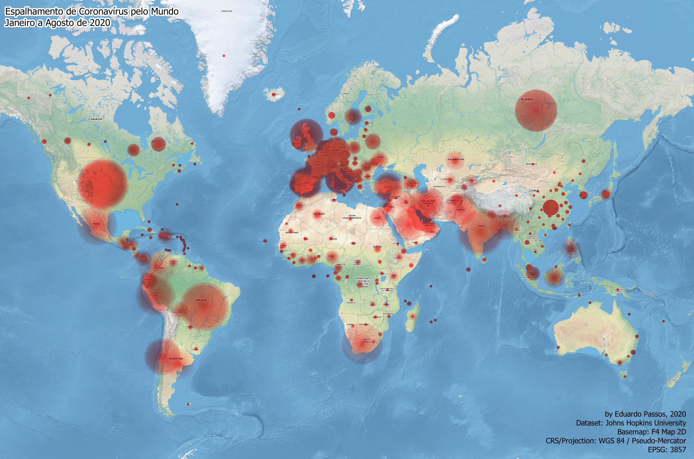

# Espalhamento Global do Coronavírus - Análise Geoespacial

Este projeto foi desenvolvido por Eduardo Passos, e esta série temporal de mapas visa representar a disseminação global do coronavírus de uma forma visual; sem números, porque todos nós já sabemos os números de casos. O objetivo aqui é ser minimalista. Para criar isso, usei o software de código aberto QGIS, baixei o dataset da Universidade Johns Hopkins no Github, espacializei o arquivo .csv para representar os casos no mapa e construí um timelapse pela data dos casos relatados.

<video controls autoplay>
  <source src="export/timelapse-animation-video.mp4" type="video/mp4">
